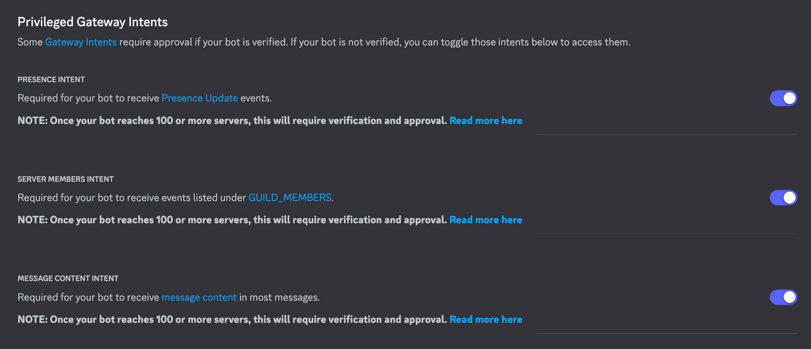
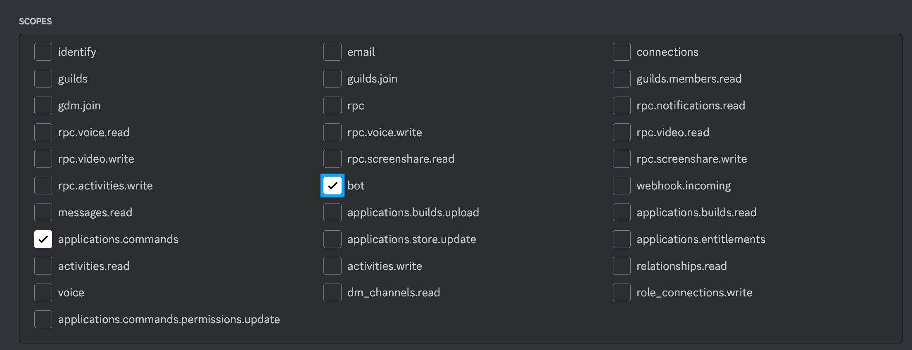
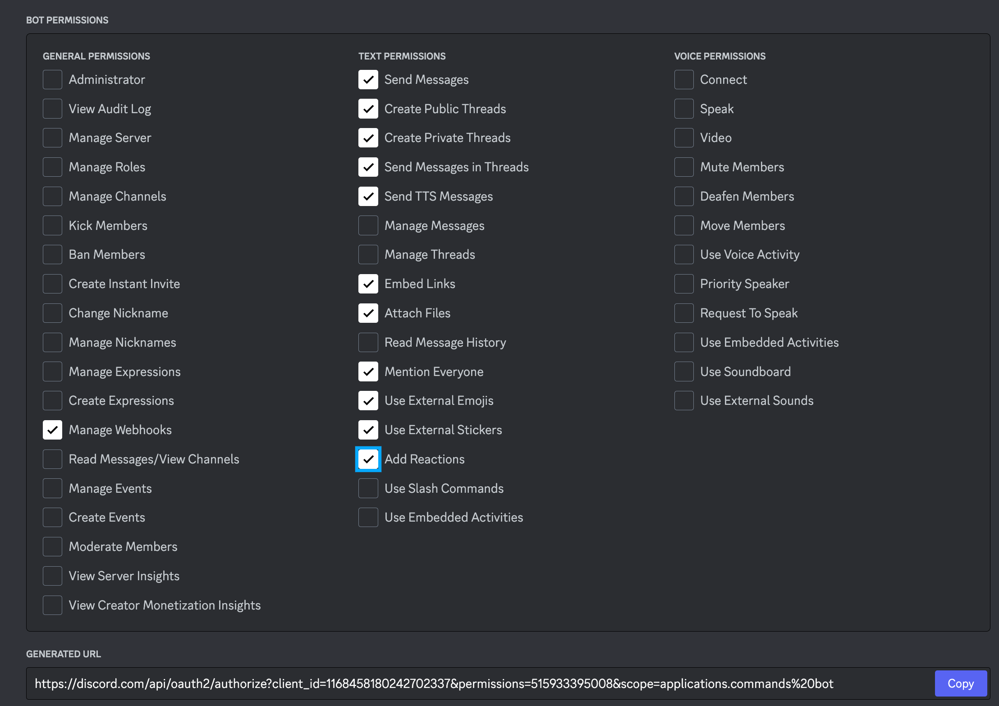
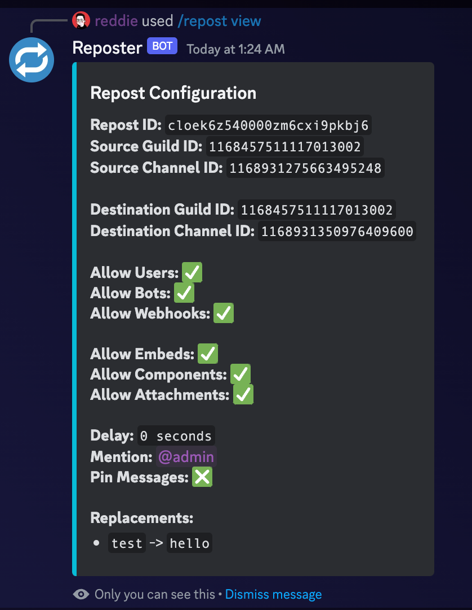

# Reposter Discord Bot

a discord bot built using discord.js v14 and Typescript that reposts messages from one channel to another, even if they are from different servers!

-   focus on configurability and function coupling
-   easy to use and setup

## Requirements

### Technical Knowledge

In order to work with this bot, one needs sufficient knowledge in Javascript/ Typescript, NodeJS, Discord.js, Docker, Postgresql, Prisma, NPM/PNPM

### Environment

-   Install Node.js v18 via NVM
-   Install Docker

### Discord Bot and Application

1. Create an application in the [Discord Developer Portal](https://discord.com/developers/applications)
2. Ensure that the bot has the `MESSAGE_CONTENT` permissions
   

-   Save the `TOKEN` and `APPLICATION ID` from the portal, as this will be used later

3. Create a bot with the following scopes and permissions\*
   
   
   \*ensure that the bot has `MANAGE_MESSAGES` and `MANAGE_WEBHOOKS` perms as they are needed for the bot features
4. Use the generated invite link and add the bot with the permissions in your desired discord servers

### Database

1. Deploy a PostgreSQL instance

-   Use your desired postgresl hosting platform
-   Deploy it via Docker:

```bash
docker run --name reposter-db -e POSTGRES_PASSWORD=somepassword --restart=on-failure -v /home/<user>/Discord-Reposter-bot/data_db:/var/lib/postgresql/data -d -p 5432:5432 postgres
```

2. Save `DATABASE_URL` in the `.env`

## Setup

0. Install project dependencies:

```bash
curl -o- https://raw.githubusercontent.com/nvm-sh/nvm/v0.39.5/install.sh | bash
nvm install 18 && nvm use 18
npm install -g pnpm
pnpm setup
pnpm add -g pm2
```

1. Clone this repo on your desired working directory
2. Update the `src/config.ts` file and `.env` file with your project variables and configurations
3. Install project dependencies `pnpm install`

```bash
pnpm install
```
4. Populate database with prisma scheme

```bash
npx prisma migrate dev --name init
```
5. Ensure that the PostgreSQL database is running and available `pnpm db-studio`

```bash
pnpm db-studio
```

6. Run `pnpm dev` to test and ensure that the bot works well

```bash
pnpm dev
```

6. Once testing is done, run bot via systemctl service

```bash
pnpm start
```

7. Create service using "sudo nano /etc/systemd/system/Discord-Reposter-bot.service"
```bash
[Unit]
Description=Discord-Reposter-bot
Requires=network.target
After=network.target

[Service]
User=<user>
Group=<user>
Type=simple
ExecStart=/home/<user>/.nvm/versions/node/v18.20.7/bin/pnpm start
Restart=always
RestartSec=10

[Install]
WantedBy=multi-user.target

```


## How it works

The bot sets up **repost configurations** that dictate a repost setup from a _source_ (a text channel) to a _destination_ (such as text channel from same or different server OR a discord webhook). There can be multiple repost configurations, allowing complex setups of `CHANNEL_A` -> `CHANNEL_B` repostingd

The project leverages the [messageCreate](https://discord.js.org/#/docs/discord.js/main/class/Client?scrollTo=e-messageCreate) event in discord. It then uses the metadata from the **repost config** to filter out data such as allow only from users/bots and to allow only embeds/components/etc. and other configurations.

In order to support DMs with users a _source_ and _destination_, the config's `guildID` and `channelID` would be set to the DM's `channelID`, the system recognizes this automatically to instead looking for a channel in the server, looks for the user DMs channel from the list of user channels available to the bot client



## Commands

| Command                                                                      | Description                                                                |
| ---------------------------------------------------------------------------- | -------------------------------------------------------------------------- |
| /channelinfo                                                                 | get guild ID and channel ID for this channel                               |
| /webhook                                                                     | creates a webhook in this channel                                          |
| /reposts                                                                     | view repost configurations in this server/user                             |
| /repost view [repost_id]                                                     | view a repost configuration                                                |
| /repost add_channel [src_guild] [src_channel] [des_guild] [des_channel]      | add a repost configuration (send to a channel/user from a channel/user)    |
| /repost add_webhook [src_guild] [src_channel] [des_webhook]                  | add a repost configuration (send to a webhook from a channel/user)         |
| /repost remove [repost_id]                                                   | remove a repost configuration                                              |
| /repost enable [repost_id]                                                   | enable a repost configuration (if it is disabled)                          |
| /repost disable [repost_id]                                                  | temporary disable a repost configuration                                   |
| /repost update_source_allows [repost_id] [users] [bots] [webhooks]           | allow reposting of messages from users/bots/webhooks                       |
| /repost update_source_allows [repost_id] [embeds] [components] [attachments] | include embeds/components/attachments in reposts                           |
| /repost update_delay [repost_id] [delay]                                     | adds a delay before sending repost to destination (0 = realtime repost)    |
| /repost update_mentions [repost_id] [mentions]                               | use this to add a mention (such as role or user) for reposted messages     |
| /repost update_nickname [repost_id] [nickname]                               | toggle true if you want author nickname to be appended to reposted message |
| /repost update_delete [repost_id] [delete]                                   | toggle true if you want bot to delete original message                     |
| /repost update_pin [repost_id] [pin]                                         | pin reposted messages (not available for webhooks)                         |
| /repost create_replacement [repost_id] [find] [replace]                      | find and replace the chosen find substring from message content            |
| /repost delete_replacement [repost_id] [find]                                | delete replacement config                                                  |
